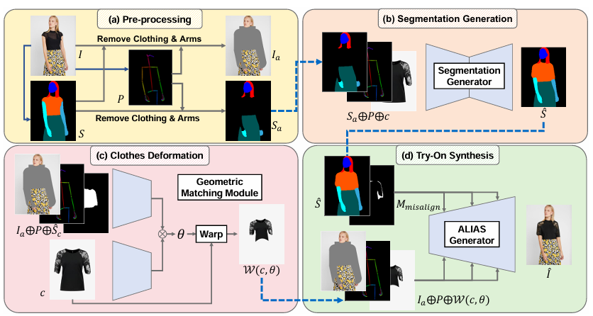

## Notice

本次虚拟换衣任务基于**VITON-HD: High-Resolution Virtual Try-On via Misalignment-Aware Normalization**(In **CVPR** 2021)一文，由于该论文官方并未公开训练代码，故未亲自利用数据集训练模型，采用其预训练模型对人物更换服装，并自行补全其衣服、人体分割和姿态捕捉的相关过程，简化测试时对输入数据的条件，通过分别输入带有背景的衣服和人物的一张照片，即可生成原VITON-HD的6种输入数据，实现虚拟换衣功能，原VITON-HD输入数据如下图所示。

| input         | 含义                              |
| ------------- | --------------------------------- |
| cloth         | 去除了背景的只有衣服的衣服图片    |
| cloth_mask    | 用黑白表示的衣服分割图 (白衣黑底) |
| person        | 去除了背景的只有人物的人物图片    |
| person_parse  | 对人体不同部位的语义分割          |
| openpose_img  | 以不同颜色呈现的人体关键点检测图  |
| openpose_json | 人体关键点的坐标数据              |

## Installation

#### VITON-HD

Windows运行环境

| Windows | 10       |
| ------- | -------- |
| GPU     | RTX 3070 |
| cudnn   | 7.6.5    |
| Cuda    | 3.7.10   |

Anaconda中虚拟环境

| python      | 3.8.18       |
| ----------- | ------------ |
| cudatoolkit | 8.0          |
| torch       | 1.13.0+cu117 |
| torchaudio  | 0.13.0+cu117 |
| torchvision | 0.14.0+cu117 |

#### Preprocess

##### 1.衣服分割

使用U2-Net预训练好的模型，不需要额外安装库函数。

##### 2.人体分割

使用 [AILIA](https://github.com/axinc-ai/ailia-models)模型库，使用python 3.6或更新的版本，安装ailia库。

```
pip3 install ailia
```

除[Tutorial](https://github.com/axinc-ai/ailia-models/blob/master/TUTORIAL.md)中步骤外，还需要在[ailia](https://github.com/axinc-ai/ailia-sdk?tab=readme-ov-file)中申请ailia SDK，也可直接点击[Download a free evaluation version of ailia SDK](https://axip-console.appspot.com/trial/terms/AILIA?lang=en)进行申请，这时需要输入正确的邮箱地址，用来接收下载链接地址和证书文件，将下载的证书文件（`AILIA.lic`）移动到`bootstrap.py`文件所在的目录（`ailia_sdk/python`）中之后，再将此页面（https://github.com/axinc-ai/ailia-models）中的`requirements.txt`下载到`bootstrap.py`文件所在的目录，然后再运行以下命令，在Windows, Mac和Linux上，下载环境依赖：

```
pip install -r requirements.txt
```

**注：Jetson和Raspberry Pi安装详情见[Tutorial](https://github.com/axinc-ai/ailia-models/blob/master/TUTORIAL.md)。**

##### 3.姿态检测

使用[Windows Portable Version](https://github.com/CMU-Perceptual-Computing-Lab/openpose/blob/master/doc/installation/0_index.md#windows-portable-demo)的OpenPose实现，按照[Windows Portable Version](https://github.com/CMU-Perceptual-Computing-Lab/openpose/blob/master/doc/installation/0_index.md#windows-portable-demo),中的步骤，下载完release后，从kaggle的库中下载openpose的模型[openpose_model | Kaggle](https://www.kaggle.com/datasets/changethetuneman/openpose-model)，然后运行‘models/getBaseModels.bat’和‘models/getCOCO_and_MPII_optional.bat’，会自动的下载相关模型。下载完成后，将我们需要的图片放在./examples/media/的文件夹下，在主目录执行以下指令：

```
bin\OpenPoseDemo.exe --image_dir examples\media --hand --write_images output\ --write_json output/ --disable_blending
```

其会将该./examples/media/目录下的所有文件都进行姿态检测。

**注：可以提前清理media目录下的文件，避免使用GPU时内存不够，使用CPU时生成时间较长。**

## Usage

已经生成批处理命令run.bat，在不同的终端上运行时，只需要将其中的绝对路径改为本机上的路径即可，运行时，在命令行中输入以下指令： 

> run person_00 cloth.jpg

其中，person是人物图像的名称，**不包括.jpg、.png后缀**，cloth.jpg是图片的名称。

运行后，其会自动修改datasets\test_pairs.txt中的人物-服装对，换装之后的结果保存为results\test\person_cloth.jpg。

**注意：**在使用前，要将传入的两张图片修改为768*1024的大小，否则会出现图像尺寸不匹配问题导致报错。

## Principle

#### VITON-HD

为了训练神经网络，理想的数据集应该是：用户+自己的衣服，与，要试穿的衣服产品图，二者作为输入，用户+试穿的衣服作为ground truth。但这是非常难得到的。一般情况下，只有产品图和模特穿着产品的照片，即只有输入没有标签。于是我们采用了VITON类的办法，即想办法把衣服的信息去掉。并且，由于日常中拍摄照片分辨率较高，为方便用户不降低分辨率直接进行虚拟试衣，我们采用在较大分辨率上表现较好的VITON-HD，并减弱扭曲的衣服和期望的衣服区域之间的错位区域中的伪影，得到1024x768尺度上的换衣结果。

其具体过程如下：

1. 首先，用已有的办法得到人体的语义分割和姿势图，然后将两者与原图相结合，并移除衣服与手臂部分。
2. 然后，将前一步生成的未除衣服与手臂部分的人体分割图像作为ground truth，利用去掉手臂和衣服的人体语义分割图、姿势图和目标服饰作为输入，通过U-Net提取特征来构建CGAN，预测人物穿上目标服饰之后的人体分割图像。
3. 接着，利用移除衣服与手臂部分后的人体分割图像、姿势图和上一步所预测的人物穿上目标服饰之后的人体分割图像中的服装区域，通过TPS变换对目标服饰进行变形，使其更加匹配人物姿势。
4. 最后，将上述信息整合到一起，生成最终图像，因为变换过的衣服不能百分百和模特穿在身上的衣服重叠，所以这里会有错误对齐，于是利用ALIAS（ALIgnment-Aware Segment normalization）模块，消除错误对齐的信息的影响。并且可以生成原本被衣服覆盖住的肌肤，衣服的图案，款式，花纹都可以较好的复现。并且清晰地保持了原模特的脸部，手部，裤子等，效果显著。



### Preprocess

#### 1.衣服分割

##### 1.1 衣服分割

对于实现衣服分割，我们采用了U2-Net来进行分割。[U2-Net](https://github.com/xuebinqin/U-2-Net)

因为要分割的是衣服，因此我们选择了数据集[[iMaterialist (Fashion) 2019 at FGVC6](https://www.kaggle.com/c/imaterialist-fashion-2019-FGVC6/data)]。这个数据集对不同的衣服的不同部位进行了不同的标记，所实现的精度已经超过了我们所需要的目标，但为了方便就选择这个数据集了。

在输出的分割图中，不同的衣服部位用不同的颜色标记。关于具体的实现，可以参考[U2-Net](https://github.com/xuebinqin/U-2-Net)官网。我自己在笔记本电脑上训练的模型精度还不错，但是[Clothes Segmentation using U2NET](https://github.com/Charlie839242/cloth-segmentation)这个仓库中提供了训练了很多轮模型，比我自己训练的模型效果要好，有需要可以从上面下载。

衣服的原图如下：


##### 1.2 把图片中非黑的像素都转化成白色

由于最终模型输出会给衣服的不同部位画上不同颜色，而VITON-HD需要的模型输入是黑白的分割图，因此需要转化。

得到的效果如下：


##### 1.3 利用获得的黑白分割图来去除衣服图片的背景

得到的效果如下：


此时，我们获得了VITON-HD输入中的cloth与cloth_mask。

#### 2. 人体分割

VITON-HD作者在论文中使用ACGPN中的分割模型来进行人体分割，然而该数据集中却并没有脖子的标签，但是VITON-HD的分割结果中是有脖子的标签的。

于是我们使用[Self-Correction-Human-Parsing](https://github.com/PeikeLi/Self-Correction-Human-Parsing)里的ATR训练集来进行训练，在该训练集中，脖子与脸用相同的颜色进行了标注，而基于LIP数据集得到的图片中并没有对脖子的标注，只标注出了人脸，于是我们将从ATR和LIP产生图片中脸的部分相减，获取到脖子的部分，并将其换一种颜色来进行标注。然后将所有非黑像素转化成白色，从而获得分割图像，进而与1.3进行相似操作得到去除了背景后的人物图像。

由于[Self-Correction-Human-Parsing](https://github.com/PeikeLi/Self-Correction-Human-Parsing)中只提供了利用GPU推理的方式，因此我选择了另一个集成了许多AI模型的库, [AILIA](https://github.com/axinc-ai/ailia-models)，这个库恰好具备了我们所需要的ATR模型和LIP模型。而且为我们提供了转换好的ONNX模型，可以在CPU上进行推理。

但是在进行分割后，我们发现该分割结果与VITON-HD数据集中的分割图标注颜色并不相同，于是我们需要将其进行转化，使其与VITON-HD数据集保持一致。

其中颜色对应关系如下所示：

| ATR得到的图  |                       |           | Sample图     |                      |          |
| ------------ | --------------------- | --------- | ------------ | -------------------- | -------- |
| 调色盘对应值 | 颜色                  | 对应部位  | 调色盘对应值 | 颜色                 | 对应部位 |
| 0            | [0, 0, 0]: 黑         | 背景      | 0            | [0, 0, 0]: 黑        | 背景     |
| 2            | [0, 128, 0]: 绿       | 头发      | 2            | [254, 0, 0]: 红      | 头发     |
| 4            | [0, 0, 128]: 蓝       | 衣服      | 5            | [254, 85, 0]: 橘色   | 衣服     |
| 5            | [128, 0, 128]: 紫     | 裤子      | 9            | [0, 85, 85]: 深绿    | \        |
| 11           | [192, 128, 0]: 棕黄   | 脸 + 脖子 | 10           | [85, 51, 0]: 棕      | 脖子     |
| 12           | [64, 0, 128]: 深紫    | 右腿      | 12           | [0, 128, 0]: 绿      | 裤子     |
| 13           | [192, 0, 128]: 粉     | 左腿      | 13           | [0, 0, 254]: 蓝      | 脸       |
| 14           | [64, 128, 128]: 浅蓝  | 右手      | 14           | [51, 169, 220]: 浅蓝 | 右手     |
| 15           | [192, 128, 128]: 肉色 | 左手      | 15           | [0, 254, 254]: 亮蓝  | 左手     |
|              |                       |           | 16           | [85, 254, 169]:浅绿  | 右腿     |
|              |                       |           | 17           | [169, 254, 85]: 亮绿 | 左腿     |

关于颜色转化过程，详情可参见[Charlie839242/An-implementation-of-preprocess-in-VITON-HD-: This repository contains the implementations of the preprocessing stages of VITON-HD (github.com)](https://github.com/Charlie839242/An-implementation-of-preprocess-in-VITON-HD-?tab=readme-ov-file#13-利用获得的黑白分割图来去除衣服图片的背景)。

此时，我们已获得VITON-HD输入中的person与person_parse。


#### 3. 姿态检测

对于生成VITON-HD需要的姿态图与关键点坐标信息，我们基于[OpenPose](https://github.com/CMU-Perceptual-Computing-Lab/openpose)进行实现，在windows系统上，利用[Windows Portable Version](https://github.com/CMU-Perceptual-Computing-Lab/openpose/blob/master/doc/installation/0_index.md#windows-portable-demo)进行实现，将骨架图保存在output里，同时将关键点坐标等信息保存在json文件中。

由此，我们获得了姿态图与json形式的关键点数据。


经历以上preprocess过程，我们们获得了VITON-HD的所有输入数据，实现了仅需输入一张有背景的人物与目标服饰图像，就可生成其换装后的图像，并且在高分辨率图像上仍有较好效果，对伪影消除较好。


## References

- [shadow2496/VITON-HD: Official PyTorch implementation of "VITON-HD: High-Resolution Virtual Try-On via Misalignment-Aware Normalization" (CVPR 2021) (github.com)](https://github.com/shadow2496/VITON-HD?tab=readme-ov-file)
- [Charlie839242/An-implementation-of-preprocess-in-VITON-HD-: This repository contains the implementations of the preprocessing stages of VITON-HD (github.com)](https://github.com/Charlie839242/An-implementation-of-preprocess-in-VITON-HD-)
- [条件生成对抗网络——cGAN原理与代码 - 知乎 (zhihu.com)](https://zhuanlan.zhihu.com/p/629503280)
- [2D虚拟试衣2021最新论文 - 知乎 (zhihu.com)](https://zhuanlan.zhihu.com/p/366500069)
- [姿势模仿教程 | 🇨🇳中文版 | Petoi Doc Center](https://docs.petoi.com/v/chinese/ying-yong-shi-li/zi-shi-mo-fang-jiao-cheng)
- [ailia-models/TUTORIAL.md at master · axinc-ai/ailia-models (github.com)](https://github.com/axinc-ai/ailia-models/blob/master/TUTORIAL.md)
- [axinc-ai/ailia-sdk: cross-platform high speed inference SDK (github.com)](https://github.com/axinc-ai/ailia-sdk?tab=readme-ov-file)
- [openpose/doc/installation/0_index.md at master · CMU-Perceptual-Computing-Lab/openpose (github.com)](https://github.com/CMU-Perceptual-Computing-Lab/openpose/blob/master/doc/installation/0_index.md#windows-portable-demo)
- [openpose_model | Kaggle](https://www.kaggle.com/datasets/changethetuneman/openpose-model)

